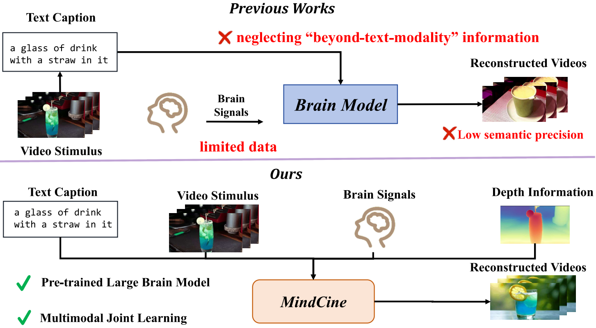
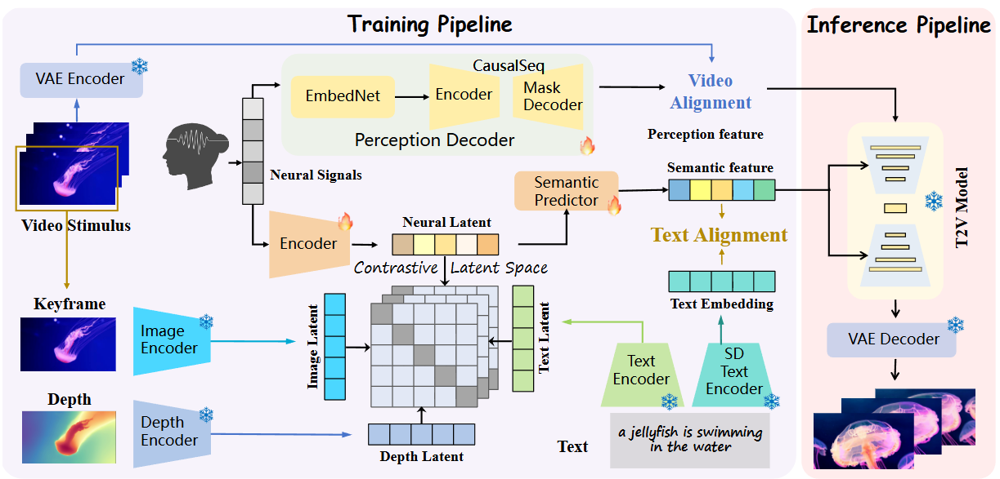

<div align="center">

<h2 style="border-bottom: 1px solid lightgray;">🧠 MindCine: Multimodal EEG-to-Video Reconstruction with Large-Scale Pretrained Models</h2>
</div>


<div style="display: flex; align-items: center; justify-content: center;">

<p align="center">
  <a href="#">
  <p align="center">
    <a href='https://arxiv.org/abs/2601.18192'></a>
    <!-- <a href='https://github.com/DanceSkyCode/Bratrix'> </a> -->
    <a href='https://huggingface.co/Tianyi1229/MindCine'></a> <br>
    <a href="https://scholar.google.com/citations?user=VyLD9McAAAAJ&hl=zh-CN" target="_blank">Tian-Yi Zhou*</a>,
    <a href="https://scholar.google.com/citations?user=99yIdXAAAAAJ&hl=zh-CN" target="_blank">Xuan-Hao Liu*</a>,
    <a href="https://scholar.google.com/citations?user=709il6EAAAAJ&hl=zh-CN" target="_blank">Bao-Liang Lu</a>,
    <a href="https://scholar.google.com/citations?user=MZXXe8UAAAAJ&hl=zh-CN" target="_blank">Wei-Long Zheng†</a>,
     <p align="center">
    Shanghai Jiao Tong University
       </p>
    <p align="center">
    * equal contribution
    † denotes the corresponding author
     </p>
  </p>
</p>


</div>

<div align="center">
<!--  -->
<div>
  
</div>

</div>

Brain Decoding Paradigms: Previous vs. Ours.

<div align="center">
<!--  -->
<div>
  
</div>

</div>

Brain Decoding Paradigms: Previous vs. Ours.


<!-- ## News -->
<h2 style="border-bottom: 1px solid lightgray; margin-bottom: 5px;">✨ Update</h2>

* **2026/01/21** MindCine is accepted by *ICASSP 2026*.

<!-- ## Environment setup -->
<h2 style="border-bottom: 1px solid lightgray; margin-bottom: 5px;">🛠️ Environment Setup</h2>

### Quick Start

```bash
# 1. Clone this repo
git clone https://github.com/KevinZhou6/MindCine.git
cd MindCine

# 2. Create the Conda environment
conda env create -f environment.yml

# 3. Activate the environment
conda activate MindCine
```

<h2 style="border-bottom: 1px solid lightgray; margin-bottom: 5px;">👍 Citations</h2>

If you find our work useful, please consider citing:

```
@article{zhou2026mindcine,
  title={MindCine: Multimodal EEG-to-Video Reconstruction with Large-Scale Pretrained Models},
  author={Zhou, Tian-Yi and Liu, Xuan-Hao and Lu, Bao-Liang and Zheng, Wei-Long},
  journal={arXiv preprint arXiv:2601.18192},
  year={2026}
}
```

<!-- ## Acknowledge -->
<h2 style="border-bottom: 1px solid lightgray; margin-bottom: 5px;">😺Acknowledge</h2>

We sincerely thank the following outstanding works:  

1. **[EEG2Video](https://github.com/XuanhaoLiu/EEG2Video/tree/main)** — *EEG2Video: Towards Decoding Dynamic Visual Perception from EEG Signals*.  
2. **[CognitionCapturer](https://github.com/XiaoZhangYES/CognitionCapturer/tree/main)** - *CognitionCapturer: Decoding Visual Stimuli from Human EEG Signals with Multimodal Information*.
3. We use the **[BIOT](https://github.com/ycq091044/BIOT)**, **[LaBraM](https://github.com/935963004/LaBraM)**, **[EEGPT](https://github.com/BINE022/EEGPT)**, **[CBraMod](https://github.com/wjq-learning/CBraMod)**, **[Gram](https://github.com/iiieeeve/Gram)** to alleviate data scarcity.

# 🏷️ License
This repository is released under the MIT license. See [LICENSE](./LICENSE) for additional details.
